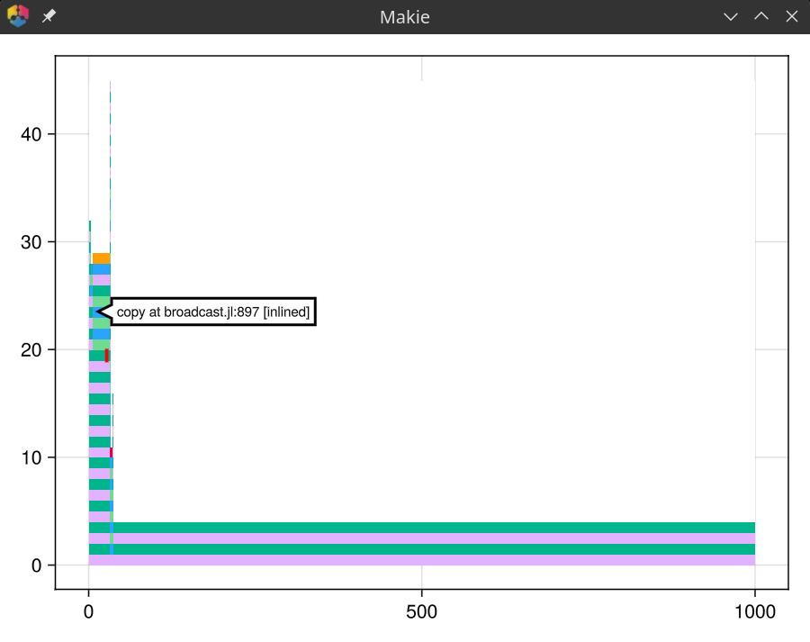

# ProfileViewMakie

[](https://github.com/SimonDanisch/ProfileViewMakie.jl/actions/workflows/CI.yml?query=branch%3Amain)

ProfileViewMakie provides interactive flame graph visualizations for Julia profiling data using Makie.jl.



## Installation

```julia
using Pkg
Pkg.add("ProfileViewMakie")
```

## Usage

ProfileViewMakie offers two main ways to create flame graph visualizations:

### Quick Profiling with `@profileview` Macro

The easiest way to profile and visualize code in one step:

```julia
using ProfileViewMakie
using GLMakie # Your backend of choice, interactive are best so WGLMakie or GLMakie
# Profile and visualize in one step
data = ProfileViewMakie.@profileview rand(5000, 5000)
```

### Manual Profiling and Visualization

For more control over the profiling process:

```julia
using ProfileViewMakie
using Profile

# Clear previous profiling data
Profile.clear()

# Profile your code
Profile.@profile rand(3000, 3000)

# Generate flame graph and visualize
g = ProfileViewMakie.flamegraph()
profileview(g)
```

## Features

- **Interactive inspection**: Hover over flame graph segments to see detailed information including file names, line numbers, and function names
- **Customizable coloring**: Uses FlameGraphs.jl color schemes for visual differentiation
- **Makie integration**: Full compatibility with Makie.jl ecosystem for saving, displaying, and customizing plots

## API Reference

### `profileview(flamegraph; flamecolor = FlameColors())`

Creates an interactive flame graph visualization for Julia profiling data.

**Arguments:**
- `flamegraph`: A flame graph object from FlameGraphs.jl containing profiling data

**Attributes:**
- `flamecolor = FlameColors()`: Coloring function for the flame graph. See [FlameGraphs.jl documentation](https://timholy.github.io/FlameGraphs.jl/stable/reference/#FlameGraphs.FlameColors) for more details.

**Returns:**
- A Makie plot object that can be displayed, saved, or further customized

### `@profileview expr`

Macro that profiles the given expression and immediately creates a flame graph visualization.

**Example:**
```julia
# Profile a recursive function
fib(n) = n <= 2 ? 1 : fib(n-1) + fib(n-2)
ProfileViewMakie.@profileview fib(30)
```
